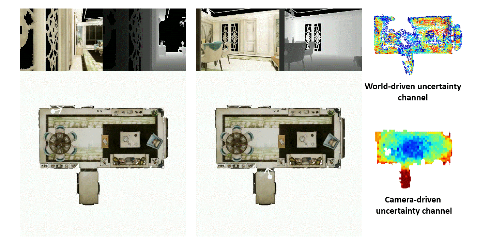

# [ECCV 2022] Towards Accurate Active Camera Localization

*Qihang Fang, *[Yingda Yin](https://yd-yin.github.io/), †[Qingnan Fan](https://fqnchina.github.io/), [Fei Xia](https://fxia22.github.io/), [Siyan Dong](https://scholar.google.com/citations?user=vtZMhssAAAAJ&hl=en/), Sheng Wang, [Jue Wang](https://juewang725.github.io/), [Leonidas Guibas](http://geometry.stanford.edu/member/guibas/index.html), †[Baoquan Chen](http://cfcs.pku.edu.cn/baoquan/)

*Equal contribution; ordered alphabetically | †Corresponding authors | [Video](https://youtu.be/pDMoZ6pjkkQ) | [arXiv](https://arxiv.org/abs/2012.04263)


<p align="center">

</p>
<p align="center">

</p>


## Installation
```bash
git clone AccurateACL --recursive
```
### Requirements
```bash
pip install -r requirements.txt
```
### Passive localizer (random forest)
#### From docker image
The docker image contains a proper environment for the random forest. Run the following command to use the image.
```bash
docker pull qihfang/spaint_python3.6.8_cuda10.0_torch1.9.0_spaint:v1.0
```

#### Compile from source
1. Dependencies
    ```bash
      - ArrayFire (version 3.3.2)
        Status: Optional (needed for touch interaction and median filtering)
        Default: Disabled
        Flag: WITH_ARRAYFIRE
    
      - Boost (version 1.58.0)
        Status: Required
    
      - CUDA (version 7.5 or above)
        Status: Optional (needed for GPU acceleration)
        Default: Enabled
        Flag: WITH_CUDA
    
      - Eigen (version 3.2.2)
        Status: Required
    
      - GLEW (version 1.12.0)
        Status: Required on Windows/Ubuntu
    
      - InfiniTAM (version 3.5)
        Status: Required
    
      - Leap Motion SDK (version 2.2.1.24116)
        Status: Optional (needed for experimental Leap Motion support)
        Default: Disabled
        Flag: WITH_LEAP
    
      - Oculus SDK (version 0.5.0.1)
        Status: Optional (needed for Oculus Rift support)
        Default: Disabled
        Flag: WITH_OVR
    
      - OpenCV (version 3.1.0)
        Status: Optional (needed for feature inspection mode)
        Default: Disabled
        Flag: WITH_OPENCV
    
      - OpenGL
        Status: Required
    
      - OpenMP
        Status: Optional, but recommended (needed for faster training/prediction)
        Default: Disabled
        Flag: WITH_OPENMP
        Notes: Doesn't work on Mac OS X
    
      - OpenNI (version 2)
        Status: Optional, but recommended (needed for live reconstruction)
        Default: Disabled
        Flag: WITH_OPENNI
    
      - SDL (version 2-2.0.7)
        Status: Required
    
      - Vicon SDK
        Status: Optional (needed for the Vicon tracker)
        Default: Disabled
        Flag: WITH_VICON
    ```
2. Build ALGLIB
    ```bash
    cd extensions/spaint/libraries
    ./build-alglib-nix.sh
    ```
3. Build

    Please make sure that the BUILD_GROVE, BUILD_GROVE_APPS, WITH_ALGLIB and WITH_OPENCV are set to ON and the ALGLIB_INCLUDE_DIR, ALGLIB_LIBRARY and ALGLIB_ROOT are set to your path.
    ```bash
    cd ..
    ./build-nix.sh "Unix Makefiles" Release
    cd build
    ccmake ..
    make -j8
    ```

### Config paths
Please specify the paths in `global_setting.py` to your paths.

## Dataset
<p>
The ACL-Synthetic and ACL-Real datasets can be downloaded <a href="https://drive.google.com/file/d/1OIKUeQDfdNuxwyTlXP3KpJyk4p-Nsyjn/view?usp=sharing">here</a>.
</p>

## Usage
### Train
```bash
python train/trainer.py --exp_name=training --env=EnvRelocUncertainty-v0 --net_type=uncertainty \
--snapshot_mode=all --batch_B=5 --batch_T=800 --batch_nn=40 --gpu=0 --gpu_cpp=1 --gpu_render=1 \
--cfg=configs/train.yaml
```
### Test

```bash
python test/policy_test.py \ 
--exp-name=test --scene-name=I43 --seq-name=seq-50cm-60deg \
--net-type=uncertainty --env=EnvRelocUncertainty-v0 --ckpt=ckpt/pretrained_model.pkl \
--cfg=configs/test.yaml --cuda-idx=0
```

## Bibtex
```bibtex
@article{fang2022towards,
  title={Towards Accurate Active Camera Localization},
  author={Fang, Qihang and Yin, Yingda and Fan, Qingnan and Xia, Fei and Dong, Siyan and Wang, Sheng and Wang, Jue and Guibas, Leonidas and Chen, Baoquan},
  journal={ECCV},
  year={2022}
}
```


## Contact
For any questions, feel free to contact the authors.

Qihang Fang: [qihfang@gmail.com](mailto:qihfang@gmail.com)

[Yingda Yin](https://yd-yin.github.io/): [yingda.yin@gmail.com](mailto:yingda.yin@gmail.com)

[Qingnan Fan](https://fqnchina.github.io/): [fqnchina@gmail.com](mailto:fqnchina@gmail.com)


## Acknowledgments
This work was supported in part by NSFC Projects of International Cooperation and Exchanges (62161146002), NSF grant IIS-1763268, a Vannevar Bush Faculty Fellowship, and a gift from the Amazon Research Awards program.

Our RL framework is based on [RLPYT](https://github.com/astooke/rlpyt) by [Adam Stooke](https://www.linkedin.com/in/adam-stooke-06bb6923/) et al. and the passive relocalizer module is based on [spaint](https://github.com/torrvision/spaint) by [Stuart Golodetz](http://research.gxstudios.net/) et al.

